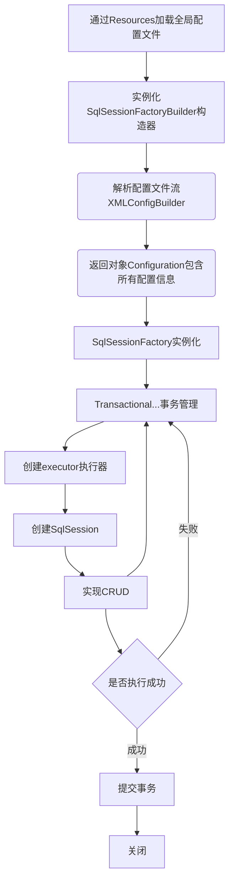

# **MyBatis**  #


---

中文文档：https://mybatis.org/mybatis-3/zh/getting-started.html

## 1.准备工作

### 1.1 配置pom.xml文件

1. 添加依赖（MySQL、MyBatis、Junit）

```xml
<dependency>
	<groupId>org.mybatis</groupId>
	<artifactId>mybatis</artifactId>
	<version>3.5.5</version>
</dependency>
```

2. 在build中配置resources避免导入资源失败（模块中最好同样配置），plugin设置默认Language Level

```xml
<build>
        <plugins>
            <plugin>
                <groupId>org.apache.maven.plugins</groupId>
                <artifactId>maven-compiler-plugin</artifactId>
                <version>2.3.2</version>
                <configuration>
                    <source>1.8</source>
                    <target>1.8</target>
                </configuration>
            </plugin>
        </plugins>
        <resources>
            <resource>
                <directory>src/main/resources</directory>
                <includes>
                    <include>**/*.properties</include>
                    <include>**/*.xml</include>
                </includes>
                <filtering>true</filtering>
            </resource>
            <resource>
                <directory>src/main/java</directory>
                <includes>
                    <include>**/*.properties</include>
                    <include>**/*.xml</include>
                </includes>
                <filtering>true</filtering>
            </resource>
        </resources>
</build>
```

---

## 2. 第一个MyBatis程序

#### 2.1 mybatis-config.xml

```xml
<?xml version="1.0" encoding="UTF8" ?>
<!DOCTYPE configuration
        PUBLIC "-//mybatis.org//DTD Config 3.0//EN"
        "http://mybatis.org/dtd/mybatis-3-config.dtd">
<configuration>
    <environments default="development">
        <environment id="development">
            <transactionManager type="JDBC"/>
            <dataSource type="POOLED">
                <property name="driver" value="com.mysql.cj.jdbc.Driver"/>
                <property name="url" value="jdbc:mysql://localhost:3306/mybatis?
									useSSL=true&amp;
									useUnicode=true&amp;
									characterEncoding=UTF-8&amp;
									serverTimezone = GMT"/>
                <property name="username" value="root"/>
                <property name="password" value="root"/>
            </dataSource>
        </environment>
    </environments>
    <mappers>
    <!--每一个mapper.xml都要在MyBatis核心配置文件中注册-->
    <mapper resource="com/pro/dao/UserMapper.xml"/>
    </mappers>
</configuration>
```

###　2.2 编写utils工具类

1. 通过配置文件获取sqlSessionFactory对象

2. 通过sqlSessionFactory获取sqlSession实例


```java
private static SqlSessionFactory sqlSessionFactory;

String resource = "mybatis-config.xml";
InputStream inputStream = Resources.getResourceAsStream(resource);
sqlSessionFactory = new SqlSessionFactoryBuilder().build(inputStream);

public static SqlSession getSqlSession(){
	return sqlSessionFactory.openSession();
}
```

### 2.3 创建实体类pojo

### 2.4 创建dao包

1. 编写UserMapper接口，提供抽象方法
2. 编写UserMapper.xml配置文件 

```xml
<!--namespace绑定一个对应的mapper接口 -->
<mapper namespace="com.pro.dao.UserMapper">
    <!--    标签相当于通过实现类重写方法-->
    <select id="getUserList" resultType="com.pro.dao.User">
        select * from mybatis.user;
    </select>
</mapper>
```

### 2.5 编写Junit测试类

```Java
SqlSession sqlSession= MyBatisUtils.getSqlSession();;
//getMapper
UserMapper mapper = sqlSession.getMapper(UserMapper.class);
List<User> userList = mapper.();
for(User user:userList){
	System.out.println(user);
}
//关闭
sqlSession.close();
```

### 2.6 CRUD

​	注意：基本类型的Type可以省略

```java
List<User> getUserList();
User getUserById(int id);
int addUser(User user);
int updateUser(User user);
int deleteUser(int id);
```

```xml
<resultMap id="UserMap" type="User">
    <result column="id" property="id"/>
    <result column="name" property="name"/>
    <result column="pwd" property="password"/>
</resultMap>

<select id="getUserList" resultType="User">
    select * from mybatis.user;
</select>

<select id="getUserById" resultMap="UserMap" parameterType="int">
    select * from mybatis.user where id=#{id};
</select>

<insert id="addUser" parameterType="User">
    insert into mybatis.user (id, name ,pwd) values (#{id},#{name},#{pwd});
</insert>

<update id="updateUser" parameterType="User">
    update mybatis.user set name=#{name},pwd=#{pwd} where id=#{id};
</update>

<delete id="deleteUser" parameterType="int">
    delete from mybatis.user where id=#{id};
</delete>
```

###　2.7 万能Map

```java
int addUserMap(Map<String, Object> map);
```

```xml
<insert id="addUserMap" parameterType="map">
	insert into mybatis.user (id, pwd) values (#{userId},#{userPwd});
</insert>
```

---

## 3. 配置解析

### 3.1 环境配置enviroments

1. **事务管理器transactionManager** --- type="JDBC (default) / MANAGED"
2. **数据源dataSource** --- 连接数据库 ---type="UNPOOLED / POOLED (default) / JNDI"

### 3.2 属性properties

​	实现引用配置文件 

1. 编写db.properties

	注意：连接数据库时，在url后配置时区

```properties
driver=com.mysql.cj.jdbc.Driver
url=jdbc:mysql://localhost:3306/mybatis?useSSL=true&useUnicode=true&characterEncoding=UTF-8&serverTimezone = GMT
username=root
password=root
```

2. 在mybatis-config.xml中引入properties

```xml
<!--xml文档中标签顺序有规定-->
<properties resource="db.properties"/>
<environments default="development">
        <environment id="development">
            <transactionManager type="JDBC"/>
            <dataSource type="POOLED">
                <property name="driver" value="${driver}"/>
                <property name="url" value="${url}"/>
                <property name="username" value="${username}"/>
                <property name="password" value="${password}"/>
            </dataSource>
        </environment>
</environments>
```

### 3.3 类型别名typeAliases

1. 直接配置（可自定义，实体类较少时使用）

```xml
<typeAliases>
	<typeAlias type="com.pro.pojo.User" alias="User"/>
</typeAliases>
```

2. 扫描实体类的包，默认别名为首字母小写（自定义需要在实体类上加注解@Alias ）

```xml
<typeAliases>
	<package name="com.pro.pojo"/>
</typeAliases>
```

3. 默认别名 --- 如_int: int         hashmap: HashMap

### 3.4 设置settings

​	改变MyBatis行为的重要设置

###　3.5 其他配置

​	类型处理器typeHandlers、对象工厂objectFactory、插件plugins

### 3.6 映射器mappers

​	通过mappers告诉 MyBatis 去哪里找映射文件

​	**方式一**：

```xml
<!-- 使用相对于类路径的资源引用 -->
<mappers>
  <mapper resource="com/pro/dao/UserMapper.xml"/>
</mappers>
```

​	**方式二**：

```xml
<!-- 使用映射器接口实现类的完全限定类名 -->
<mappers>
  <mapper class="com.pro.dao.UserMapper"/>
</mappers>
```

​	**方式三**：

```xml
<!-- 将包内的映射器接口实现全部注册为映射器 -->
<mappers>
  <package name="com.pro.dao"/>
</mappers>
```

- 使用方式二、三注意点：接口和其Mapper配置文件必须同名、在同一个包下


### 3.7 生命周期

- **SqlSessionFactoryBuilder**

	局部变量，一旦创建了SqlSessionFactory，就不需要了

- **SqlSessionFactory**

	相当于连接池一旦被创建应在应用运行阶段持续存在，最佳作用域是应用作用域，适用单例模式

- **SqlSession**

  连接到数据库连接池的一个请求，线程不安全，不能被共享，用完需关闭，否则资源被占用

- **Mapper**

  每一个Mapper对应具体业务

  

  

  ```mermaid
  graph LR
  A[SqlSessionFactory]-->B[SqlSession]
  A-->C[SqlSession]
  A-->D[SqlSession]
  C-->E(Mapper)
  C-->F(Mapper)
  C-->G(Mapper)
  ```

  

---

## 4. 解决属性名和字段名不一致的问题

###　4.1 问题

​	实体类中属性名改变，如pwd --> password，查找时返回null

​	**暴力解决方法**：**起别名**：select pwd as password from user where id=1；

### 4.2 结果集映射resultMap

​	MyBatis中最重要的元素，对于复杂的语句，通过显式的结果映射描述关系

```xml
<resultMap id="UserMap" type="User">
    <result column="pwd" property="password"/>
</resultMap>

<select id="getUserById" resultMap="UserMap" parameterType="int">
        select * from mybatis.user where id=#{id};
</select>
```

---

## 5. 日志

### 5.1 日志工厂

​	MyBatis设置中logImpl：掌握：LOG4J、STDOUT_LOGGING

​	**标准日志输出STDOUT_LOGGING**

```xml
<settings>
    <setting name="logImpl" value="STDOUT_LOGGING"/>
</settings>
static Logger logger = Logger.getLogger(UserMapperTest.class);
```

### 5.2 LOG4J

​	可以定义日志输出格式、定义日志消息级别、通过配置文件配置

  1. 导入log4j包
  2. 载入log4j.properties
  3. 在要使用log4j的类中导入包
  4. 生成日志对象，参数为当前的class

```java
static Logger logger = Logger.getLogger(UserMapperTest.class);
```

5. 日志级别

```java
logger.info("enter log4j");
logger.debug("enter log4j");
logger.error("enter log4j");
```

---

## 6. 分页

### 6.1 使用LIMIT分页

``` mysql
SELECT * FROM user LIMIT startIndex,pageSize;
```

### 6.2 使用MyBatis分页

```java
List<User> getUserByLimit(Map<String,Integer> map);
```

```xml
<select id="getUserByLimit" parameterType="map" resultType="User">
    select * from mybatis.user limit #{startIndex},#{pageSize};
</select>
```

```java
public void getUserByLimit(){
    SqlSession sqlSession = MyBatisUtils.getSqlSession();
    UserMapper mapper = sqlSession.getMapper(UserMapper.class);
    HashMap<String, Integer> map = new HashMap<>();
    map.put("startIndex",0);
    map.put("pageSize",2);
    List<User> userByLimit = mapper.getUserByLimit(map);
    for (User user : userByLimit) {
        System.out.println(user);
    }
}
```

### 6.3 使用RowBounds分页

```java
List<User> getUserByRowBounds();
```

```xml
<select id="getUserByRowBounds" resultMap="UserMap">
    select * from mybatis.user;
</select>
```

```
@Test
public void getUserByRowBounds(){
    SqlSession sqlSession = MyBatisUtils.getSqlSession();
    RowBounds rowBounds =new RowBounds(1,2);
    List<User> userList = sqlSession.selectList("com.pro.dao.UserMapper.getUserByRowBounds"
    											, null, rowBounds);
    for (User user : userList) {
        System.out.println(user);
    }
    sqlSession.close();
}
```

### 6.4 分页插件PageHelper

​	https://pagehelper.github.io/

---

## 7. 使用注解开发

### 7.1 面向接口编程

​	**根本原因**：解耦、提高复用、上层不用关心具体实现、Java语言中对接口的限制可以避免因类继承而引起的所有问题

​	**类继承所面临的问题**：父类的实现细节会影响子类的行为，子类的实现可能会影响父类

### 7.2 注解

​	映射的语句可以不用 XML 来配置，而可以使用 Java 注解来配置，在接口中实现。复杂的语句尽量不要使用

```java
@Select("select * from user")
List<User> getUserList();
```

​	**本质**：反射机制

​	**底层**：动态代理

### 7.3 注解CRUD

​	工具类中通过参数实现**自动提交**：

```Java
public static SqlSession getSqlSession() {
    return sqlSessionFactory.openSession(true);
}
```

​	选择：

```Java
@Select("select * from user where id=#{id}")
User getUserById(@Param("id") int id);
```

​	插入：

```java
@Insert("insert into user(id,name,pwd) values(#{id},#{name},#{password})")
//引用类型不用@Param
int addUser(User user);
```

​	更改：

```Java
@Update("update user set name=#{name},pwd=#{password} where id=#{id}")
int updateUser(User user);
```

​	删除：

```Java
@Delete("delete from user where id=#{uid}")
int deleteUser(@Param("uid") int id);
```

---

## 8. Lombok

### 8.1 导入jar包

``` xml
<!-- https://mvnrepository.com/artifact/org.projectlombok/lombok -->
<dependency>
    <groupId>org.projectlombok</groupId>
    <artifactId>lombok</artifactId>
    <version>1.18.12</version>
    <scope>provided</scope>
</dependency>
```

### 8.2 IDEA中下载插件

### 8.3 在类中添加注解

​	**常用**：

- **@Data**：无参构造、getter & setter、toString、hashCode、equals

- **@AllArgsConstructor** ：有参构造
- @**NoArgsConstructor**：无参构造

---

## 9.  多对一处理

### 9.1 测试环境搭建

1. 新建实体类  Teacher、Student

  2. 建立Mapper接口

  3. 编写TeacherMapper、StudentMapper的xml配置文件并绑定

  4. 查询测试

```java
@Data
public class Student {
    private int id;
    private String name;
    private Teacher teacher;
}
```

```java
@Data
public class Teacher {
    private int id;
    private String name;
}
```

### 9.2 问题

​	单一resultType不能同时查询多表

​	getStudent -> Student(id=1, name=小明, teacher=null)

### 9.3 思路

​	复杂的属性单独处理

- 对象 association
- 集合 collection
- javaType：用来指定实体类中属性的类型
- ofType：用来指定映射到List或集合中的pojo类型，即泛型中的约束类型

​	**方式一**：按照查询嵌套处理（子查询）

1. 查询学生信息

 	2. 根据查询出的学生tid，找到对应的老师

```xml
<resultMap id="StudentTeacher" type="Student">
    <association property="teacher" column="tid" javaType="Teacher" select="getTeacher"/>
</resultMap>
<select id="getStudent" resultMap="StudentTeacher">
    select * from mybatis.student;
</select>
<select id="getTeacher" resultType="Teacher">
    select * from mybatis.teacher where id=#{tid};
</select>
```

​	**方式二**：按照结果嵌套处理（联表查询）

1. SQL查询出结果之后，手动对应每一项的关系

```xml
<resultMap id="StudentTeacher2" type="Student">
    <result property="id" column="sid"/>
    <result property="name" column="sname"/>
    <association property="teacher"  javaType="Teacher">
        <result property="name" column="tname"/>
    </association>
</resultMap>
<select id="getStudent2" resultMap="StudentTeacher2">
    select s.id sid,s.name sname,t.name tname
    from mybatis.student s,mybatis.teacher t
    where s.id=t.id;
</select>
```

---

## 10. 一对多处理

### 10.1 测试环境搭建

​	实体类：

```java
@Data
public class Student {
    private int id;
    private String name;
    private int tid;
}
```

```java
@Data
public class Teacher {
    private int id;
    private String name;
    private List<Student> students;
}
```

###　10.2 按照结果嵌套处理

```xml
<resultMap id="TeacherStudent" type="Teacher">
    <result property="id" column="tid"/>
    <result property="name" column="tname"/>
    <collection property="students"  ofType="Student">
        <result property="id" column="sid"/>
        <result property="name" column="sname"/>
        <result property="tid" column="tid"/>
    </collection>
</resultMap>

<select id="getTeacher" resultMap="TeacherStudent">
    select s.id sid,s.name sname,t.name tname,t.id tid
    from mybatis.student s,mybatis.teacher t
    where s.tid=t.id and t.id=#{tid};
</select>
```

### 10.3 按照查询嵌套处理

```xml
<select id="getTeacher2" resultMap="TeacherStudent2">
	select * from mybatis.teacher where id=#{tid};
</select>
<resultMap id="TeacherStudent2" type="Teacher">
    <collection property="students" javaType="ArrayList" 
    ofType="Student" select="getStudentByTeacher" column="id"/>
</resultMap> 
<select id="getStudentByTeacher" resultType="Student">
    select * from mybatis.student where tid=#{tid};
</select>
```

---

## 11. 动态SQL

​	通过不同条件拼接SQL语句

### 11.1 环境搭建

​	实体类：

```java
public class Blog {
    private String id;
    private String title;
    private String author;
    private Date createTime; //属性名与字段名不一致，在xml中设置
    private int views;
  	//...
}
```

### 11.2 if

​	当if中的条件满足时，在SQL语句后面进行拼接

```xml
<select id="queryBlogIf" parameterType="map" resultType="blog">
    select * from mybatis.blog where 1=1
    <if test="title!=null">
        and title=#{title}
    </if>
    <if test="author!=null">
        and author=#{author}
    </if>
</select>
```

### 11.3 choose、when、otherwise

​	与java中的switch语句类似

```xml
<select id="findActiveBlogLike"
     resultType="Blog">
  SELECT * FROM BLOG WHERE state = ‘ACTIVE’
  <choose>
    <when test="title != null">
      AND title like #{title}
    </when>
    <when test="author != null and author.name != null">
      AND author_name like #{author.name}
    </when>
    <otherwise>
      AND featured = 1
    </otherwise>
  </choose>
</select>
```

### 11.4 trim(where、set)

​	*where* 标签只会在子元素返回任何内容的情况下才插入 “WHERE” 子句。而且，若子句的开头为 “AND” 或 “OR”，*where* 标签也会将它们去除

```xml
<select id="findActiveBlogLike"
     resultType="Blog">
  SELECT * FROM BLOG
  <where>
    <if test="state != null">
         state = #{state}
    </if>
    <if test="title != null">
        AND title like #{title}
    </if>
    <if test="author != null and author.name != null">
        AND author_name like #{author.name}
    </if>
  </where>
</select>
```

​	用于动态更新语句的类似解决方案叫做 *set，*set标签可以用于动态包含需要更新的列，忽略其它不更新的列

```xml
<update id="updateAuthorIfNecessary">
  update Author
    <set>
      <if test="username != null">username=#{username},</if>
      <if test="password != null">password=#{password},</if>
      <if test="email != null">email=#{email},</if>
      <if test="bio != null">bio=#{bio}</if>
    </set>
  where id=#{id}
</update>
```

​	trim标签则可以通过自定义实现where、set功能

```xml
<trim prefix="WHERE" prefixOverrides="AND |OR ">
  ...
</trim>
```

```xml
<trim prefix="SET" suffixOverrides=",">
  ...
</trim>
```

### 11.5 foreach

​	*foreach* 元素的功能非常强大，它允许指定一个集合，声明可以在元素体内使用的集合项（item）和索引（index）变量，也允许指定开头与结尾的字符串以及集合项迭代之间的分隔符，同时不会错误地添加多余的分隔符。可以将任何可迭代对象（如 List、Set 等）、Map 对象或者数组对象作为集合参数传递给 *foreach*。当使用可迭代对象或者数组时，index 是当前迭代的序号，item 的值是本次迭代获取到的元素。当使用 Map 对象（或者 Map.Entry 对象的集合）时，index 是键，item 是值。

```xml
<select id="selectPostIn" resultType="domain.blog.Post">
  SELECT *
  FROM POST P
  WHERE ID in
  <foreach item="item" index="index" collection="list"
      open="(" separator="," close=")">
        #{item}
  </foreach>
</select>
```

### 11.6 SQL片段

​	使用sql标签抽取重复部分

```xml
<sql id="conditions">
    <if test="title!=null">
        and title=#{title}
    </if>
    <if test="author!=null">
        and author=#{author}
    </if>
</sql>
```

​	在需要使用的地方通过include标签引用

```xml
<select id="queryBlogIf" parameterType="map" resultType="blog">
    select * from mybatis.blog
    <where>
        <include refid="conditions"> </include>
    </where>
</select>
```

​	**注意**：

- 最好基于单表来定义片段
- 不要存在where标签

---

## 12. 缓存

​	存在内存的临时数据，使用缓存可以减少与数据库交互，提高效率

### 12.1 MyBatis缓存

- 默认情况下，只启用了本地的会话缓存（SqlSession级别），它仅仅对一个会话中的数据进行缓存。
- 二级缓存基于namespace级别，需要手动配置和开启，可以通过缓存接口cache自定义

### 12.2 一级缓存

​	相当于一个map，从中取数据

​	测试：查询同一数据，SQL只执行一次

```java
User userById1 = mapper.getUserById(1);
User userById2 = mapper.getUserById(1);
System.out.println(userById1);
System.out.println(userById2);
```

```log
==>  Preparing: select * from mybatis.user where id=?
==> Parameters: 1(Integer)
<==    Columns: id, name, pwd
<==        Row: 1, lam, 1997
<==      Total: 1
```

​	缓存属性：

- 映射语句文件中的所有 select 语句的结果将会被缓存
- 缓存会保存列表或对象（无论查询方法返回哪种）的 1024 个引用
- 缓存会被视为读/写缓存，这意味着获取到的对象并不是共享的，可以安全地被调用者修改，而不干扰其他调用者或线程所做的潜在修改

​	失效的情况：

- 映射语句文件中的所有 insert、update 和 delete 语句会刷新缓存
- 缓存会使用最近最少使用算法（LRU, Least Recently Used）算法来清除不需要的缓存
- 缓存不会定时进行刷新（也就是说，没有刷新间隔）
- 查询不同的Mapper
- 手动清理

```java
sqlSession.clearCache();
```

### 12.3  二级缓存

​	会话关闭后，一级缓存的数据被保存到二级缓存，不同mapper的数据在各自的map中

​	在mybatis-config.xml中显式开启全局缓存：

```xml
<settings>
    <setting name="logImpl" value="STDOUT_LOGGING"/>
    <setting name="cacheEnabled" value="true"/>
</settings>
```

​	开启二级缓存，在Mapper.xml中添加标签：

```xml
<cache/>
```

​	可以在标签中修改属性：

```xml
<cache
  eviction="FIFO"
  flushInterval="60000"
  size="512"
  readOnly="true"/>
```

​	这个更高级的配置创建了一个 FIFO 缓存，每隔 60 秒刷新，最多可以存储结果对象或列表的 512 个引用，而且返回的对象被认为是只读的，因此对它们进行修改可能会在不同线程中的调用者产生冲突

​	可用的清除策略：

- `LRU` – 最近最少使用：移除最长时间不被使用的对象（默认）
- `FIFO` – 先进先出：按对象进入缓存的顺序来移除它们
- `FIFO` – 先进先出：按对象进入缓存的顺序来移除它们
- `WEAK` – 弱引用：更积极地基于垃圾收集器状态和弱引用规则移除对象

​	注意：

​		二级缓存是事务性的。这意味着，当 SqlSession 完成并提交时，或是完成并回滚，但没有执行 flushCache=true 的 insert/delete/update 语句时，缓存会获得更新

​	测试：

```Java
SqlSession sqlSession = MyBatisUtils.getSqlSession();
SqlSession sqlSession2 = MyBatisUtils.getSqlSession();

UserMapper mapper = sqlSession.getMapper(UserMapper.class);
User userById1 = mapper.getUserById(1);
System.out.println(userById1);
sqlSession.close();

UserMapper mapper2 = sqlSession2.getMapper(UserMapper.class);
User userById2 = mapper2.getUserById(1);
System.out.println(userById2);
sqlSession2.close();
```

- 问题：需要先将实体类序列化

```java
public class User implements Serializable{...}
```

### 12.4 缓存原理

1. 每一个SqlSession有其自己的一级缓存，用户查询数据第一次查询二级缓存，若没有则查询一级缓存，若没有则查询数据库，将数据放入一级缓存
2. 每一个Mapper有其自己的二级缓存，属于同一Mapper的SqlSession关闭时，将一级缓存的数据提交到二级缓存
3. 调优：如select标签中的useCache属性、update标签中的flushCache属性

### 12.5 自定义缓存

1. 在Mapper.xml中指定第三方缓存的Type

 	2. 自定义缓存，需要实现Cache接口

---

## ps. MyBatis详细执行流程




## pps. MySQL

引擎、索引、索引优化、InnoDB


